===================
Visualise Results
===================
.. _top:

------------------
Opioid administration - Generalized Model
------------------
.. contents:: Table of Contents
   :local:
   :depth: 2

General IV Information
===========

.. image:: Generalized_model/drug_type_data.png
	:align: right

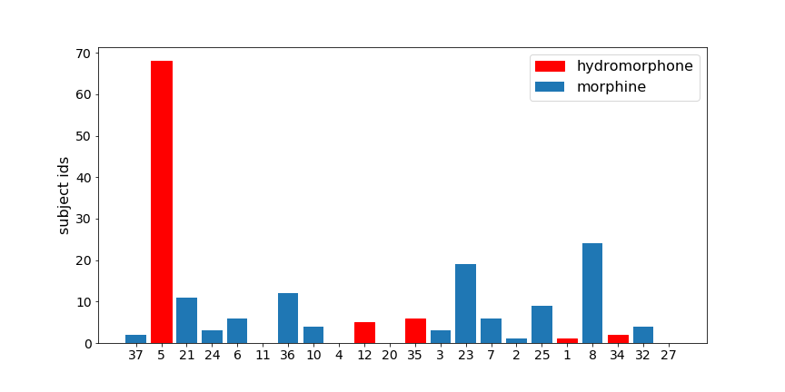

Total Duration= 1431 Hours

`back to top <#top>`_

Model
===========

.. image:: Generalized_model/lstm_figure.png
	:align: right

`back to top <#top>`_

Pid 5
===========

Prediction plots
--------------------------

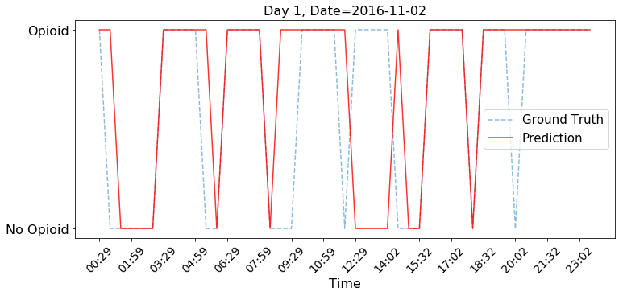

.. image:: Generalized_model/pid5/5_2.png
	:align: right

.. image:: Generalized_model/pid5/5_3.png
	:align: right

.. image:: Generalized_model/pid5/5_4.png
	:align: right

.. image:: Generalized_model/pid5/5_5.png
	:align: right

.. image:: Generalized_model/pid5/5_6.png
	:align: right

.. image:: Generalized_model/pid5/5_7.png
	:align: right

.. image:: Generalized_model/pid5/5_8.png
	:align: right

`back to top <#top>`_

Confusion Matrix
--------------------------

.. image:: Generalized_model/pid5/normalized_confusion_matrix.png
	:align: right

.. image:: Generalized_model/pid5/unnormalized_confusion_matrix.png
	:align: right

`back to top <#top>`_

Pid 6
===========
Prediction plots
--------------------------

.. image:: Generalized_model/pid6/6_0.png
	:align: right

.. image:: Generalized_model/pid6/6_2.png
	:align: right

.. image:: Generalized_model/pid6/6_3.png
	:align: right

.. image:: Generalized_model/pid6/6_4.png
	:align: right

`back to top <#top>`_

Confusion Matrix
--------------------------

.. image:: Generalized_model/pid6/normalized_confusion_matrix.png
	:align: right

.. image:: Generalized_model/pid6/unnormalized_confusion_matrix.png
	:align: right

`back to top <#top>`_

Pid 7
===========
Prediction plots
--------------------------

.. image:: Generalized_model/pid7/7_0.png
	:align: right

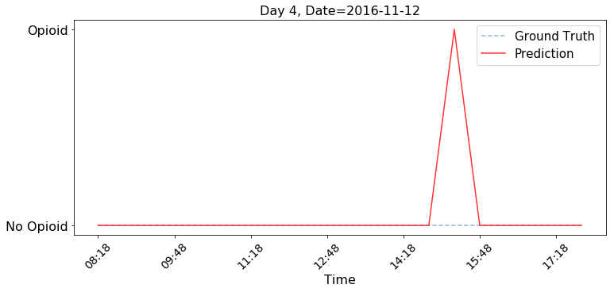

`back to top <#top>`_

Confusion Matrix
--------------------------

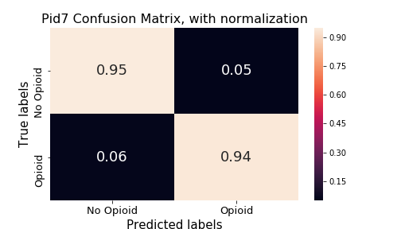

.. image:: Generalized_model/pid7/unnormalized_confusion_matrix.png
	:align: right

`back to top <#top>`_

Pid 8
===========
Prediction plots
--------------------------

.. image:: Generalized_model/pid8/8_1.png
	:align: right

.. image:: Generalized_model/pid8/8_2.png
	:align: right

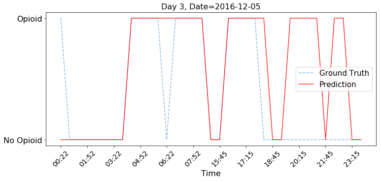

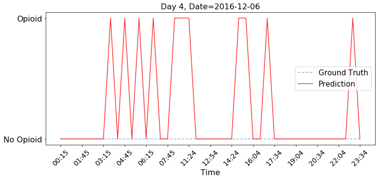

`back to top <#top>`_

Confusion Matrix
--------------------------

.. image:: Generalized_model/pid8/normalized_confusion_matrix.png
	:align: right

`back to top <#top>`_

Pid 34
===========
Prediction plots
--------------------------

.. image:: Generalized_model/pid34/34_0.png
	:align: right

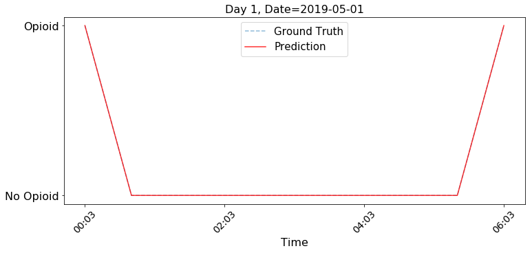

.. image:: Generalized_model/pid34/34_2.png
	:align: right

`back to top <#top>`_

Confusion Matrix
--------------------------

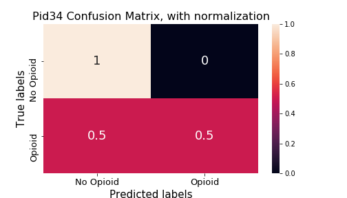

.. image:: Generalized_model/pid34/unnormalized_confusion_matrix.png
	:align: right

`back to top <#top>`_

Pid 35
===========
Prediction plots
--------------------------

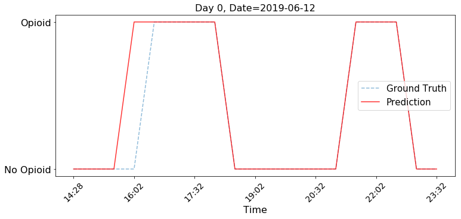

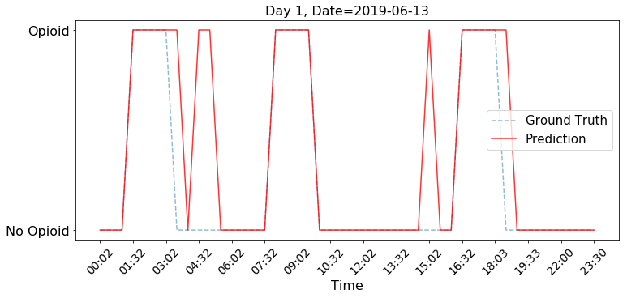

.. image:: Generalized_model/pid35/35_2.png
	:align: right

`back to top <#top>`_

Confusion Matrix
--------------------------

.. image:: Generalized_model/pid35/normalized_confusion_matrix.png
	:align: right

.. image:: Generalized_model/pid35/unnormalized_confusion_matrix.png
	:align: right

`back to top <#top>`_

Pid 36
===========
Prediction plots
--------------------------

.. image:: Generalized_model/pid36/36_0.png
	:align: right

.. image:: Generalized_model/pid36/36_1.png
	:align: right

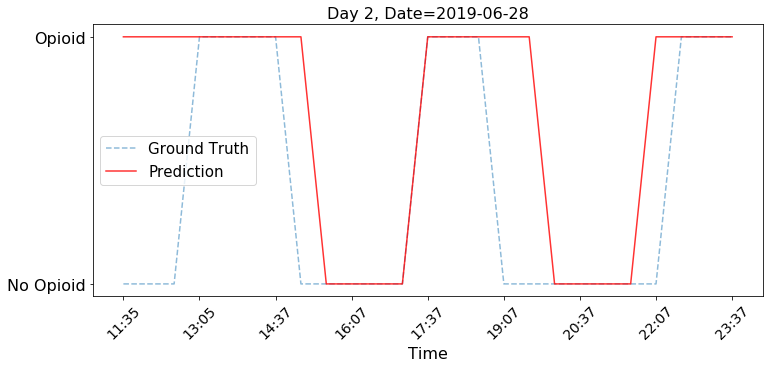

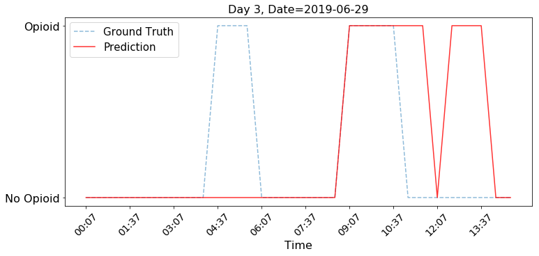

`back to top <#top>`_

Confusion Matrix
--------------------------

.. image:: Generalized_model/pid36/normalized_confusion_matrix.png
	:align: right

.. image:: Generalized_model/pid36/unnormalized_confusion_matrix.png
	:align: right

`back to top <#top>`_

Pid 10
===========

Prediction plots
--------------------------

.. image:: Generalized_model/pid10/10_day0.png
	:align: right

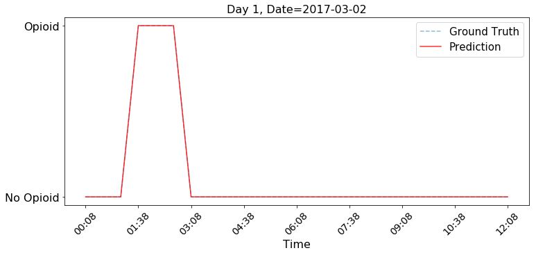

`back to top <#top>`_

Confusion Matrix
--------------------------

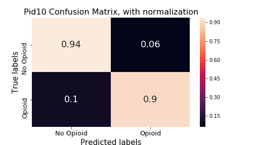

`back to top <#top>`_

Intepretation	 plots
--------------------------

MAE 30 min, Random MAE 26 min

`back to top <#top>`_

Pid 12
===========

Prediction plots
--------------------------

.. image:: Generalized_model/pid12/12_day1.png
	:align: right

.. image:: Generalized_model/pid12/12_day2.png
	:align: right

`back to top <#top>`_

Confusion Matrix
--------------------------

.. image:: Generalized_model/pid12/normalized_confusion_matrix.png
	:align: right

`back to top <#top>`_

Intepretation	 plots
--------------------------

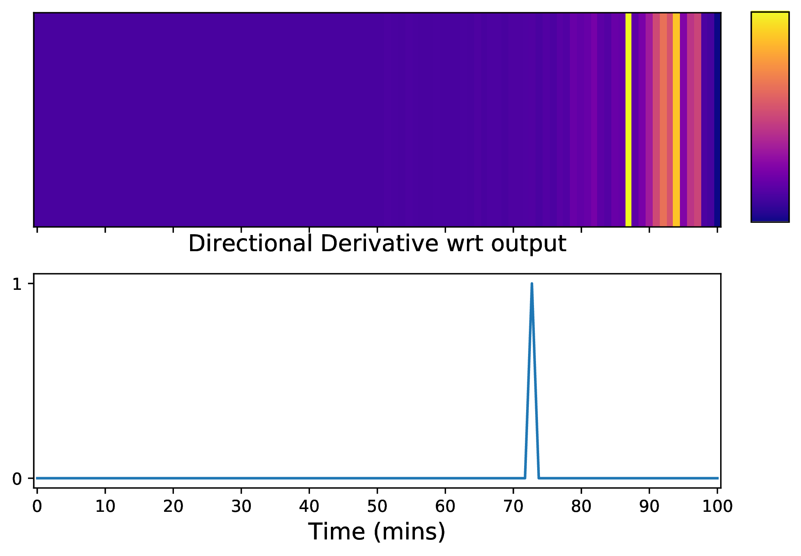

MAE 16 min, Random MAE 33 min

`back to top <#top>`_

Pid 23
===========

Prediction plots
--------------------------

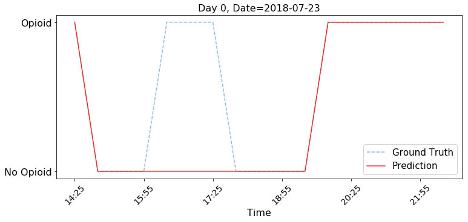

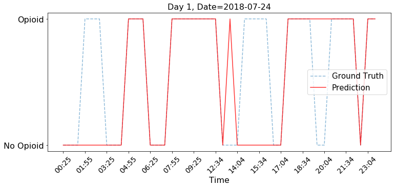

.. image:: Generalized_model/pid23/23_day3.png
	:align: right

`back to top <#top>`_

Confusion Matrix
--------------------------

.. image:: Generalized_model/pid23/normalized_confusion_matrix.png
	:align: right

.. image:: Generalized_model/pid23/unnormalized_confusion_matrix.png
	:align: right

`back to top <#top>`_

Intepretation	 plots
--------------------------

____

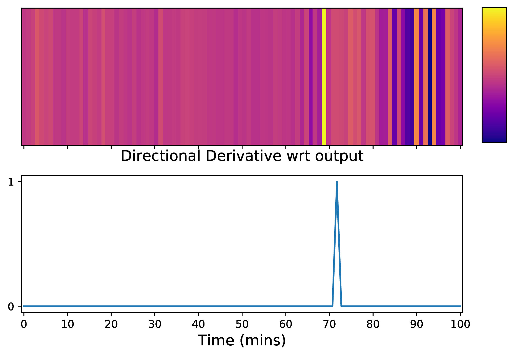
____

____

.. image:: Generalized_model/pid23/23_25.png
	:align: right

MAE 14 min, Random 32 min

`back to top <#top>`_

Pid 24
===========

Prediction plots
--------------------------

.. image:: Generalized_model/pid24/24_day1.png
	:align: right

.. image:: Generalized_model/pid24/24_day2.png
	:align: right

`back to top <#top>`_

Confusion Matrix
--------------------------

.. image:: Generalized_model/pid24/normalized_confusion_matrix.png
	:align: right

`back to top <#top>`_

Intepretation	 plots
--------------------------

____

____

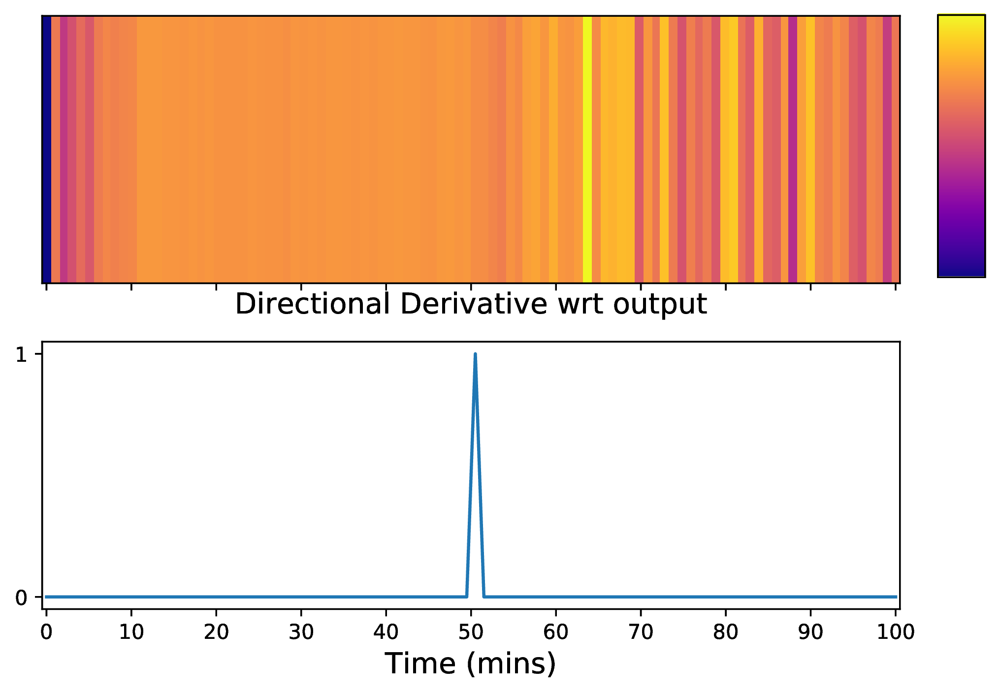

MAE 11 min , Random MAE 36 min

`back to top <#top>`_

Pid 25
===========

Prediction plots
--------------------------

.. image:: Generalized_model/pid25/25_day0.png
	:align: right

.. image:: Generalized_model/pid25/25_day1.png
	:align: right

.. image:: Generalized_model/pid25/25_day2.png
	:align: right

`back to top <#top>`_

Confusion Matrix
--------------------------

.. image:: Generalized_model/pid25/unnormalized_confusion_matrix.png
	:align: right

`back to top <#top>`_

Intepretation	 plots
--------------------------

____

____

MAE 22 min, Random MAE 35 min

`back to top <#top>`_

Pid 32
===========

Prediction plots
--------------------------

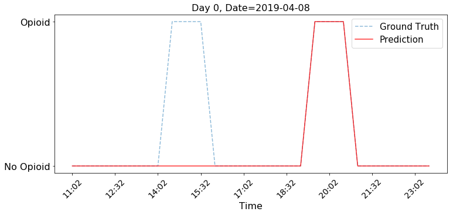

.. image:: Generalized_model/pid32/32_day1.png
	:align: right

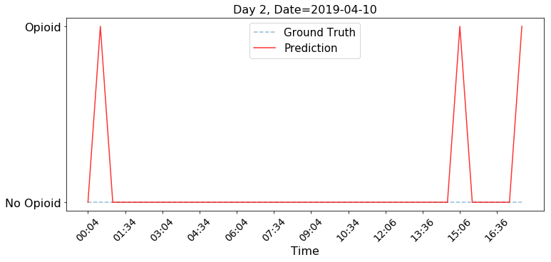

`back to top <#top>`_

Confusion Matrix
--------------------------

.. image:: Generalized_model/pid32/normalized_confusion_matrix.png
	:align: right

.. image:: Generalized_model/pid32/unnormalized_confusion_matrix.png
	:align: right

`back to top <#top>`_

Intepretation	 plots
--------------------------

____

MAE 23 min, Random MAE 27 min

`back to top <#top>`_

Pid 37
===========

Prediction plots
--------------------------

.. image:: Generalized_model/pid37/37_day0.png
	:align: right

`back to top <#top>`_

Confusion Matrix
--------------------------

`back to top <#top>`_

Intepretation	 plots
--------------------------

____

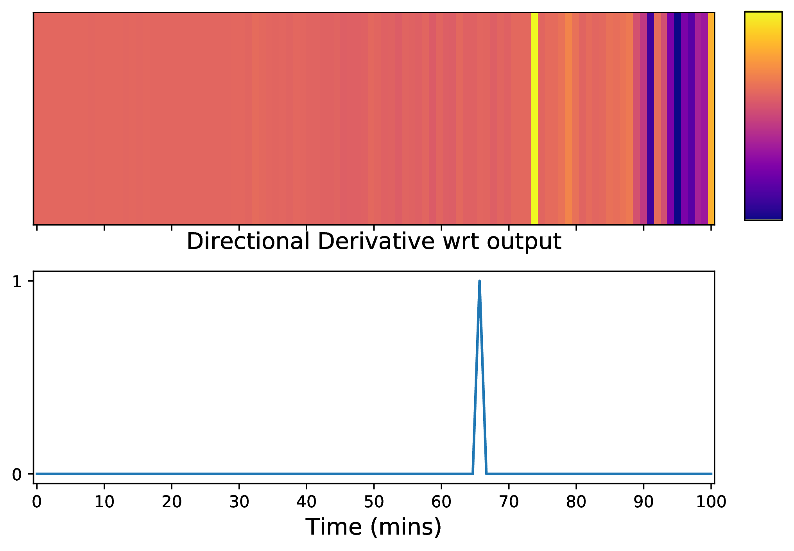

MAE 12 min, Random MAE 36 min

`back to top <#top>`_

Final Confusion Matrix / ROC plot
===========

--------------------------

.. image:: Generalized_model/normalized_confusion_matrix.png
	:align: right

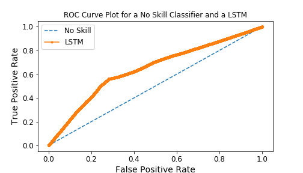

`back to top <#top>`_

Miscellaneous
===========

--------------------------

.. image:: Generalized_model/barplot_series_len.png
	:align: right

`back to top <#top>`_