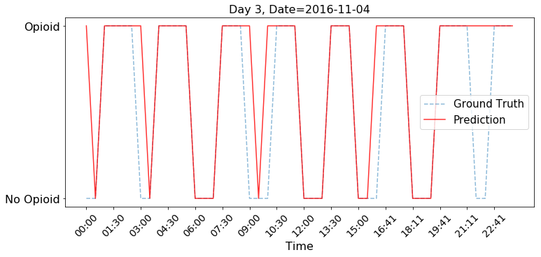
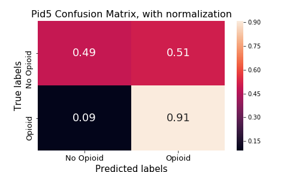
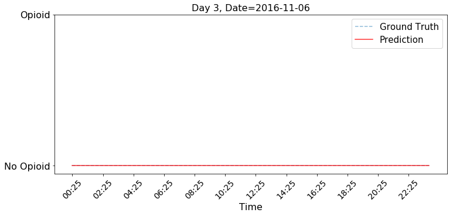
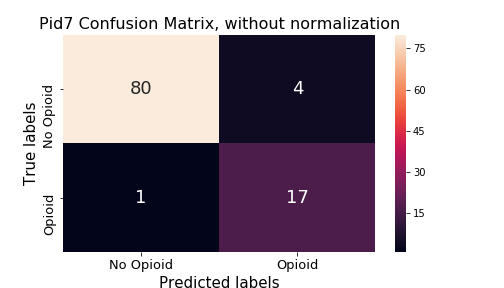
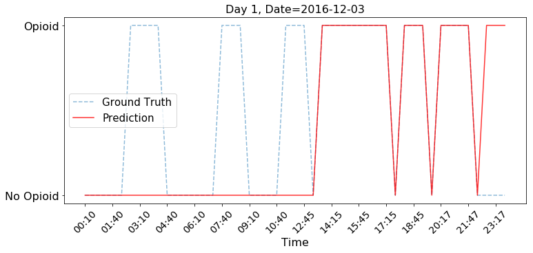
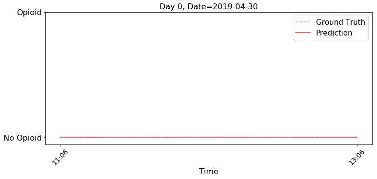
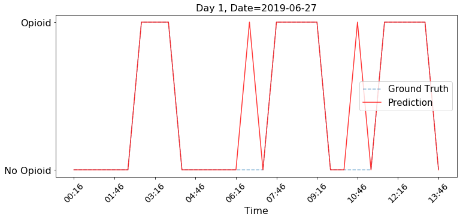
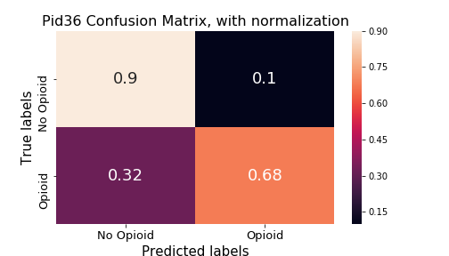
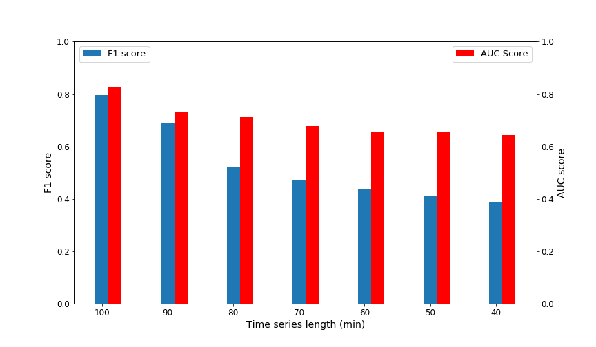

===================
Visualise Results
===================
.. _top:

------------------
Opioid administration - Generalized Model
------------------
.. contents:: Table of Contents
   :local:
   :depth: 2

General IV Information
===========

.. image:: Generalized_model/drug_type_data.png
	:align: right

.. image:: Generalized_model/subject_drug_data.png
	:align: left

Pid 5
===========

Prediction plots
--------------------------

.. image:: Generalized_model/pid5/5_0.png
	:align: right

.. image:: Generalized_model/pid5/5_1.png
	:align: right

.. image:: Generalized_model/pid5/5_4.png
	:align: right

.. image:: Generalized_model/pid5/5_5.png
	:align: right

.. image:: Generalized_model/pid5/5_6.png
	:align: right

.. image:: Generalized_model/pid5/5_8.png
	:align: right

`back to top <#top>`_

Confusion Matrix
--------------------------

.. image:: Generalized_model/pid5/unnormalized_confusion_matrix.png
	:align: right

`back to top <#top>`_

Pid 6
===========
Prediction plots
--------------------------

.. image:: Generalized_model/pid6/6_0.png
	:align: right

.. image:: Generalized_model/pid6/6_1.png
	:align: right

.. image:: Generalized_model/pid6/6_4.png
	:align: right

.. image:: Generalized_model/pid6/6_5.png
	:align: right

`back to top <#top>`_

Confusion Matrix
--------------------------

.. image:: Generalized_model/pid6/normalized_confusion_matrix.png
	:align: right

.. image:: Generalized_model/pid6/unnormalized_confusion_matrix.png
	:align: right

`back to top <#top>`_

Pid 7
===========
Prediction plots
--------------------------

.. image:: Generalized_model/pid7/7_1.png
	:align: right

.. image:: Generalized_model/pid7/7_2.png
	:align: right

.. image:: Generalized_model/pid7/7_3.png
	:align: right

.. image:: Generalized_model/pid7/7_4.png
	:align: right

`back to top <#top>`_

Confusion Matrix
--------------------------

.. image:: Generalized_model/pid7/normalized_confusion_matrix.png
	:align: right

`back to top <#top>`_

Pid 8
===========
Prediction plots
--------------------------

.. image:: Generalized_model/pid8/8_0.png
	:align: right

.. image:: Generalized_model/pid8/8_2.png
	:align: right

.. image:: Generalized_model/pid8/8_3.png
	:align: right

.. image:: Generalized_model/pid8/8_4.png
	:align: right

`back to top <#top>`_

Confusion Matrix
--------------------------

.. image:: Generalized_model/pid8/normalized_confusion_matrix.png
	:align: right

.. image:: Generalized_model/pid8/unnormalized_confusion_matrix.png
	:align: right

`back to top <#top>`_

Pid 34
===========
Prediction plots
--------------------------

.. image:: Generalized_model/pid34/34_1.png
	:align: right

.. image:: Generalized_model/pid34/34_2.png
	:align: right

`back to top <#top>`_

Confusion Matrix
--------------------------

.. image:: Generalized_model/pid34/normalized_confusion_matrix.png
	:align: right

.. image:: Generalized_model/pid34/unnormalized_confusion_matrix.png
	:align: right

`back to top <#top>`_

Pid 35
===========
Prediction plots
--------------------------

.. image:: Generalized_model/pid35/35_0.png
	:align: right

.. image:: Generalized_model/pid35/35_1.png
	:align: right

`back to top <#top>`_

Confusion Matrix
--------------------------

`back to top <#top>`_

Pid 36
===========
Prediction plots
--------------------------

.. image:: Generalized_model/pid36/36_0.png
	:align: right

.. image:: Generalized_model/pid36/36_2.png
	:align: right

.. image:: Generalized_model/pid36/36_3.png
	:align: right

`back to top <#top>`_

Confusion Matrix
--------------------------

.. image:: Generalized_model/pid36/unnormalized_confusion_matrix.png
	:align: right

`back to top <#top>`_

Final Confusion Matrix / ROC plot
===========

--------------------------

.. image:: Generalized_model/normalized_confusion_matrix.png
	:align: right

.. image:: Generalized_model/unnormalized_confusion_matrix.png
	:align: right

.. image:: Generalized_model/ROC_all.png
	:align: right

`back to top <#top>`_

Miscellaneous
===========

--------------------------

`back to top <#top>`_