===================
Visualise Results
===================
.. _top:

------------------
Opioid administration - Generalized Model
------------------
.. contents:: Table of Contents
   :local:
   :depth: 2

General IV Information
===========

.. image:: Generalized_model/drug_type_data.png
	:align: right

.. image:: Generalized_model/subject_drug_data.png
	:align: right

Total Duration= 1431 Hours

`back to top <#top>`_

Model
===========

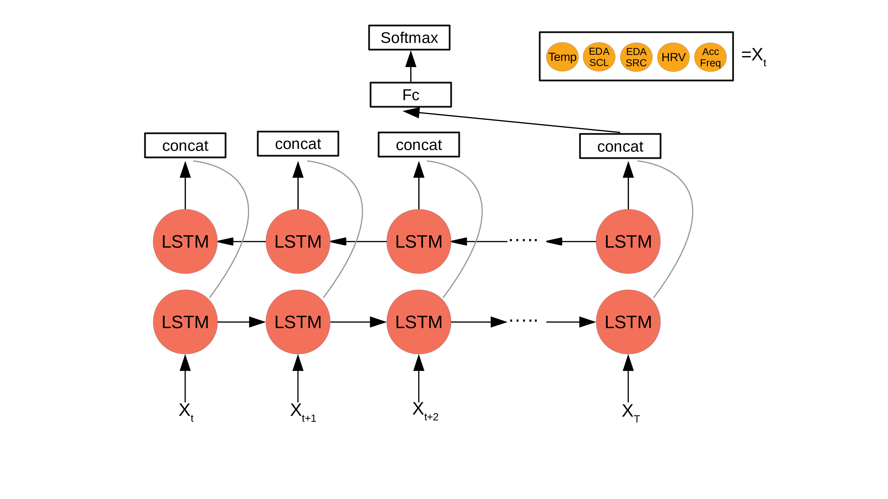

`back to top <#top>`_

Pid 5
===========

Prediction  and interpretation plots
--------------------------

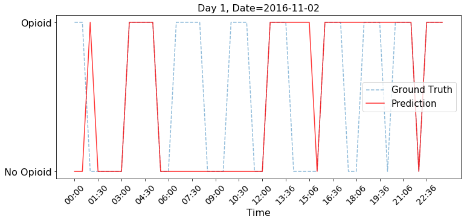

.. image:: Generalized_model/pid5/5_day2.png
	:align: right

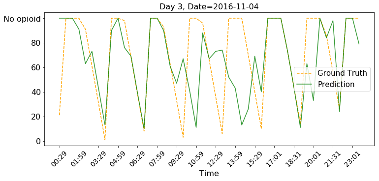

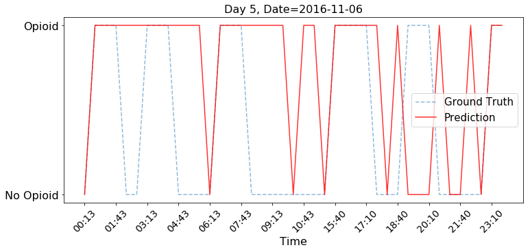

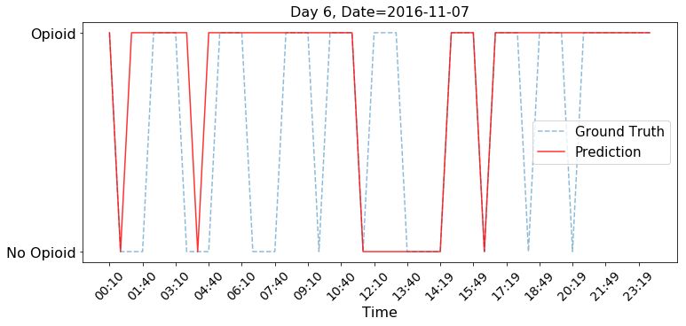

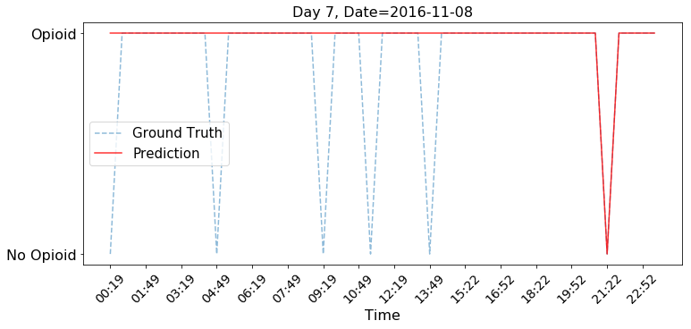

.. image:: Generalized_model/pid5/5_day7_interpretation.png
	:align: right

`back to top <#top>`_

Confusion Matrix
--------------------------

.. image:: Generalized_model/pid5/normalized_confusion_matrix.png
	:align: right

`back to top <#top>`_

Pid 6
===========
Prediction plots
--------------------------

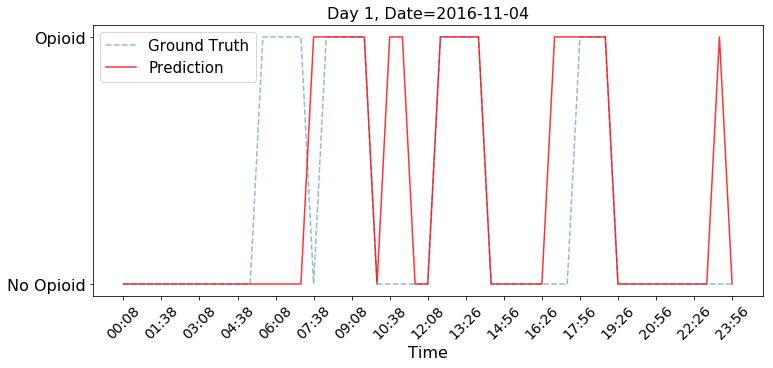

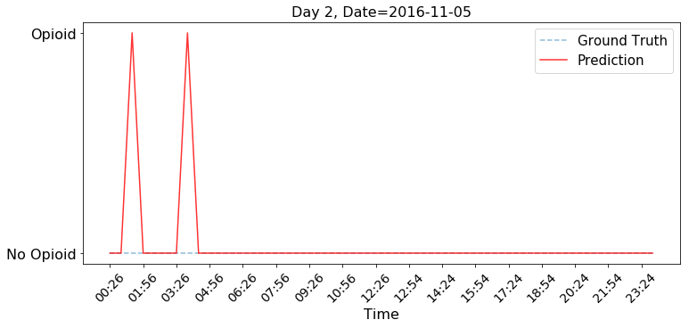

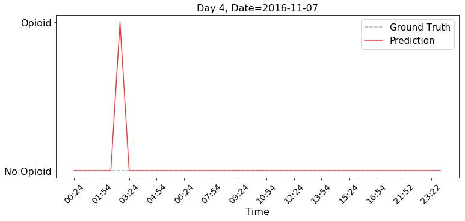

.. image:: Generalized_model/pid6/6_day4_interpretation.png
	:align: right

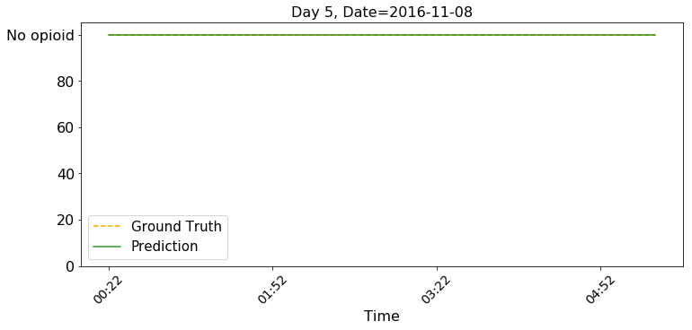

`back to top <#top>`_

Confusion Matrix
--------------------------

.. image:: Generalized_model/pid6/unnormalized_confusion_matrix.png
	:align: right

`back to top <#top>`_

Pid 7
===========
Prediction plots
--------------------------

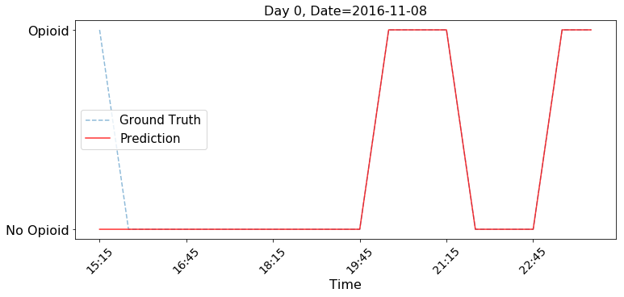

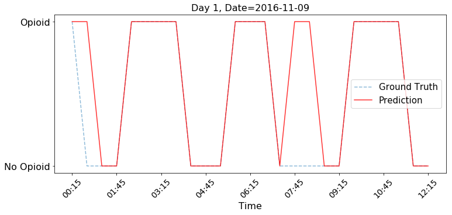

.. image:: Generalized_model/pid7/7_day4.png
	:align: right

`back to top <#top>`_

Confusion Matrix
--------------------------

.. image:: Generalized_model/pid7/normalized_confusion_matrix.png
	:align: right

.. image:: Generalized_model/pid7/unnormalized_confusion_matrix.png
	:align: right

`back to top <#top>`_

Pid 8
===========
Prediction plots
--------------------------

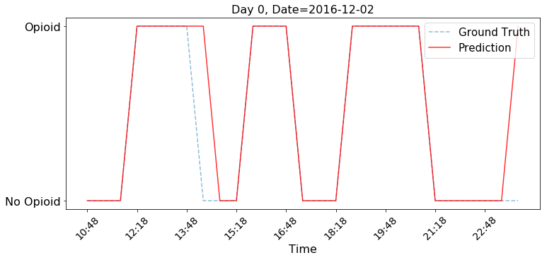

.. image:: Generalized_model/pid8/8_day3.png
	:align: right

`back to top <#top>`_

Confusion Matrix
--------------------------

.. image:: Generalized_model/pid8/unnormalized_confusion_matrix.png
	:align: right

`back to top <#top>`_

Pid 34
===========
Prediction plots
--------------------------

.. image:: Generalized_model/pid34/34_day2_interpretation.png
	:align: right

`back to top <#top>`_

Confusion Matrix
--------------------------

.. image:: Generalized_model/pid34/normalized_confusion_matrix.png
	:align: right

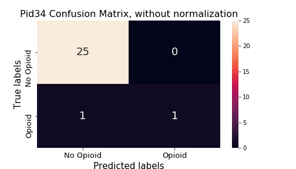

`back to top <#top>`_

Pid 35
===========
Prediction plots
--------------------------

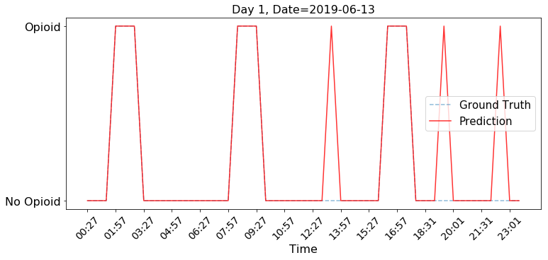

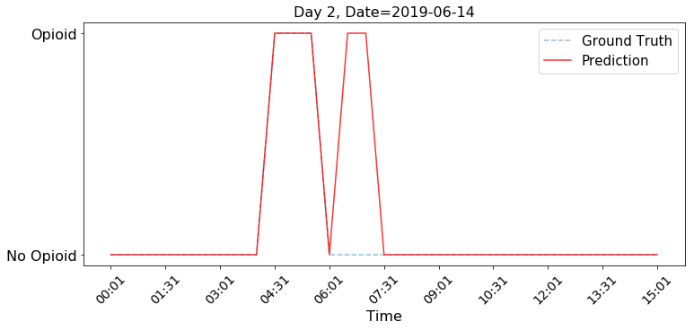

`back to top <#top>`_

Confusion Matrix
--------------------------

.. image:: Generalized_model/pid35/normalized_confusion_matrix.png
	:align: right

.. image:: Generalized_model/pid35/unnormalized_confusion_matrix.png
	:align: right

`back to top <#top>`_

Pid 36
===========
Prediction plots
--------------------------

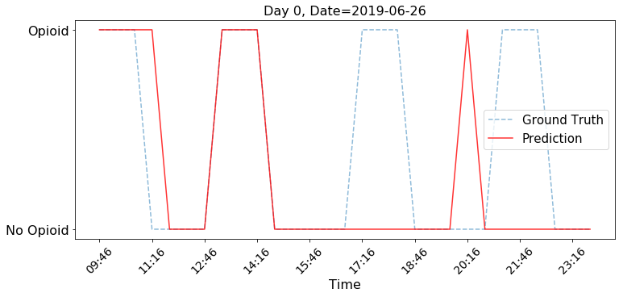

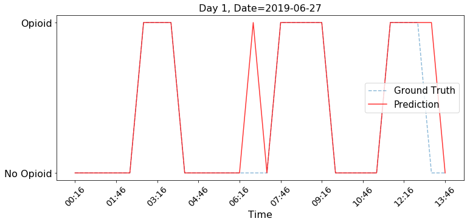

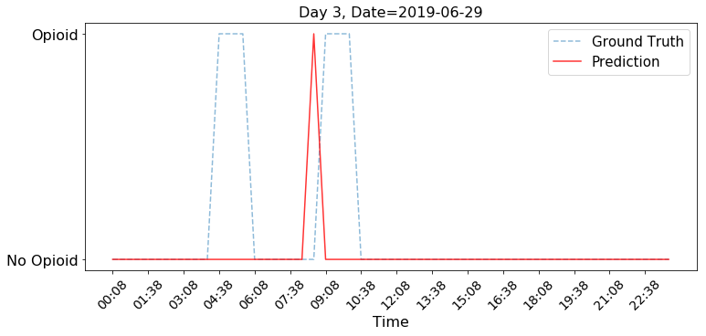

`back to top <#top>`_

Confusion Matrix
--------------------------

.. image:: Generalized_model/pid36/normalized_confusion_matrix.png
	:align: right

`back to top <#top>`_

Pid 10
===========

Prediction plots
--------------------------

.. image:: Generalized_model/pid10/10_day0.png
	:align: right

.. image:: Generalized_model/pid10/10_day1.png
	:align: right

`back to top <#top>`_

Confusion Matrix
--------------------------

.. image:: Generalized_model/pid10/normalized_confusion_matrix.png
	:align: right

.. image:: Generalized_model/pid10/unnormalized_confusion_matrix.png
	:align: right

`back to top <#top>`_

Pid 12
===========

Prediction plots
--------------------------

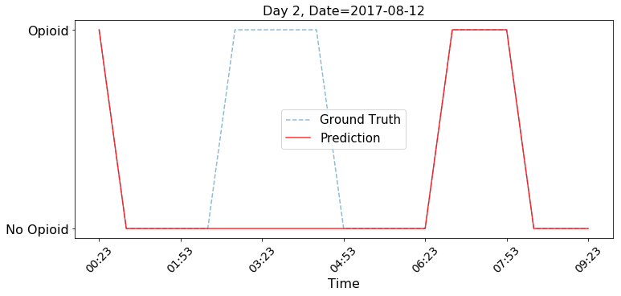

`back to top <#top>`_

Confusion Matrix
--------------------------

.. image:: Generalized_model/pid12/unnormalized_confusion_matrix.png
	:align: right

`back to top <#top>`_

Pid 23
===========

Prediction plots
--------------------------

.. image:: Generalized_model/pid23/23_day0.png
	:align: right

.. image:: Generalized_model/pid23/23_day1.png
	:align: right

.. image:: Generalized_model/pid23/23_day2.png
	:align: right

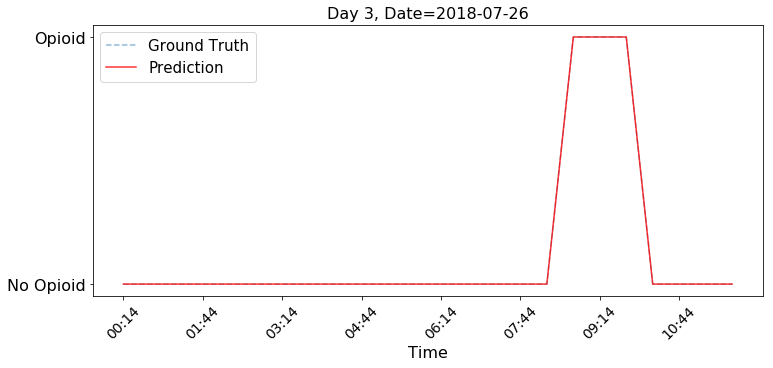

`back to top <#top>`_

Confusion Matrix
--------------------------

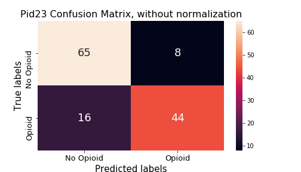

`back to top <#top>`_

Pid 24
===========

Prediction plots
--------------------------

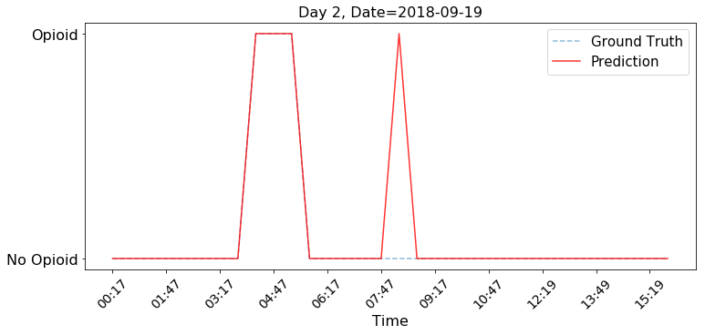

`back to top <#top>`_

Confusion Matrix
--------------------------

.. image:: Generalized_model/pid24/unnormalized_confusion_matrix.png
	:align: right

`back to top <#top>`_

Pid 25
===========

Prediction plots
--------------------------

.. image:: Generalized_model/pid25/25_day0.png
	:align: right

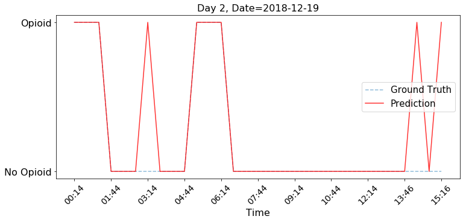

`back to top <#top>`_

Confusion Matrix
--------------------------

.. image:: Generalized_model/pid25/normalized_confusion_matrix.png
	:align: right

`back to top <#top>`_

Pid 32
===========

Prediction plots
--------------------------

.. image:: Generalized_model/pid32/32_day0.png
	:align: right

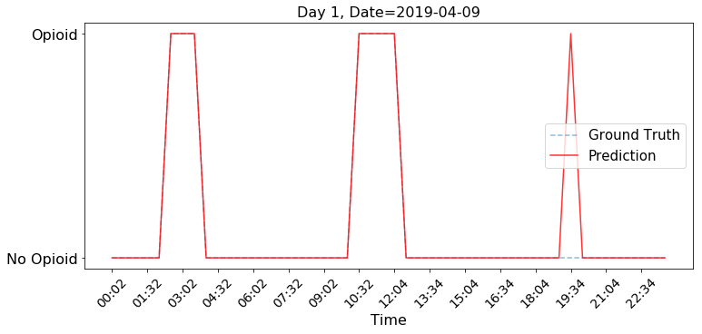

.. image:: Generalized_model/pid32/32_day2.png
	:align: right

.. image:: Generalized_model/pid32/32_day2_interpretation.png
	:align: right

`back to top <#top>`_

Confusion Matrix
--------------------------

.. image:: Generalized_model/pid32/unnormalized_confusion_matrix.png
	:align: right

`back to top <#top>`_

Pid 37
===========

Prediction plots
--------------------------

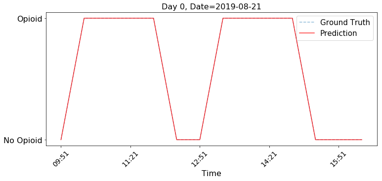

`back to top <#top>`_

Confusion Matrix
--------------------------

.. image:: Generalized_model/pid37/normalized_confusion_matrix.png
	:align: right

.. image:: Generalized_model/pid37/unnormalized_confusion_matrix.png
	:align: right

`back to top <#top>`_

Final Confusion Matrix / ROC plot
===========

--------------------------

.. image:: Generalized_model/unnormalized_confusion_matrix.png
	:align: right

.. image:: Generalized_model/ROC_all.png
	:align: right

`back to top <#top>`_

Miscellaneous
===========

--------------------------

.. image:: Generalized_model/barplot_series_len.png
	:align: right

`back to top <#top>`_

Demographic Analysis
===========

History type
--------------------------

.. image:: Generalized_model/Demographics/History.png
	:align: right

Gender
--------------------------

BMI
--------------------------

`back to top <#top>`_