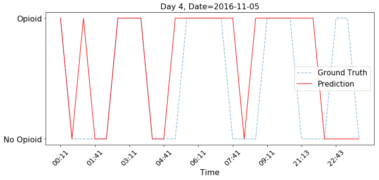

===================
Visualise Results
===================

------------------
Opioid administration - Generalized Model
------------------
.. contents:: Table of Contents
   :local:
   :depth: 1

Pid 5
===========

--------------------------

.. image:: Generalized_model/pid5/5_0.png
	:align: right

.. image:: Generalized_model/pid5/5_1.png
	:align: right

.. image:: Generalized_model/pid5/5_2.png
	:align: right

.. image:: Generalized_model/pid5/5_3.png
	:align: right

.. image:: Generalized_model/pid5/5_7.png
	:align: right

.. image:: Generalized_model/pid5/5_8.png
	:align: right

Confusion Matrix
--------------------------

.. image:: Generalized_model/pid5/normalized_confusion_matrix.png
	:align: right

.. image:: Generalized_model/pid5/unnormalized_confusion_matrix.png
	:align: right

Pid 6
===========

--------------------------

.. image:: Generalized_model/pid6/6_0.png
	:align: right

.. image:: Generalized_model/pid6/6_1.png
	:align: right

.. image:: Generalized_model/pid6/6_2.png
	:align: right

.. image:: Generalized_model/pid6/6_3.png
	:align: right

.. image:: Generalized_model/pid6/6_5.png
	:align: right

Confusion Matrix
--------------------------

.. image:: Generalized_model/pid6/normalized_confusion_matrix.png
	:align: right

